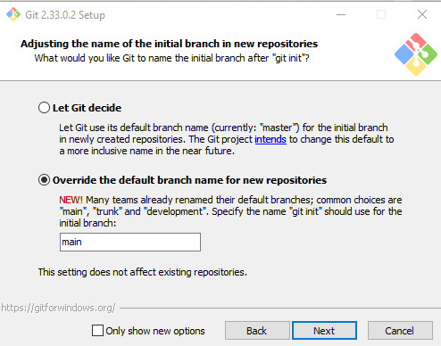

# Overview

Have you ever written some code and want to be able to share it with others? If so, then you’re in the right place! In this post, we will learn the basics of Git, including:

* Installing Git
* Git Repository Hosting Options
* Common Git Commands
* Hello Git Repository

# Installing Git

## Windows

Step one is to head over to the Git downloads page and select your operating system to download.

https://git-scm.com/downloads

Execute the exe once it finishes downloading. I would keep all of the defaults on the installation screens, except on the “Adjusting the name of the initial branch in new repositories” screen, I would recommend selecting to override the default and specifying what it should be. This will ensure that your default branch name will be named consistently.



Click install on the final screen and Finish when the install is complete

To get  Git ready to go locally, you will need to configure your user information.  To do this, open a command prompt, and execute the following commands:

```console
git config --global user.name "<Your Name Here>"
git config --global user.email "<Your Email Address Here>"
```

# Git Repository Hosting Options

Now that you have Git installed locally, you need to find a place to host your Git Repositories. Two of the more well-known platforms are GitLab and GitHub. While GitHub is more well known, GitLab has some interesting DevOps features that make it worth looking into. I’ve provided a few highlights for each below:

[Github](https://github.com/pricing)

* Repository Platform with automation actions to support CI pipelines
* 2,000 automation minutes/month in public repositories
* 500 GB storage per repository  
<i> Note: Check their pricing page for latest offerings</i>

[GitLab](https://gitlab.com/pricing/)

* DevOps platform with repositories, build/deploy pipelines included
* 400 CI pipline minutes included in Free tier
* 10 GB Storage Limit per repository
<i> Note: Check their pricing page for latest offerings</i>

# Common Git Commands

As you start working with your Git repositories, there are some Git commands that you will use quite often. I’ve included a list of the most common commands below:

|Command     |Description                                                                                                     |
|------------|----------------------------------------------------------------------------------------------------------------|
|git config	 |Configure user information for all local repositories                                                           |
|git status	 |Shows the working tree’s status                                                                                 |
|git clone	 |Clones a repository into a new folder in the current directory                                                  |
|git switch	 |Switches the current branch in the repository                                                                   |
|git checkout|	Switches branches and updates files to match the branch you are checking out. Prepares branch to be worked in.|
|git add	 |Adds new and modified files to the changes that will be included in the next commit.                            |
|git push	 |Adds local commits to the repository                                                                            |
|git fetch	 |Downloads from the remote repository                                                                            |

<br/>

See git’s [documentation page](https://git-scm.com/docs) for more details and commands as you want to do more advanced operations with Git.

# Creating Your First Repository
To create your first repository, first decide on a location where your repositories will be stored locally.  Ideally, you will choose a location close to the root directory, such as c:\repos.  

To create your first local repository, we will need to:

* Create your repos folder, if it doesn't currently exist
* Create a folder to store your repository content.  In this example, HelloGit
* Navigate to your repository folder in a console and execute the git init command

```console
echo "create repos folder"
cd c:\
mkdir repos

echo "create HelloGit folder - first repo"
cd repos
mkdir HelloGit

echo "initialize repository"
cd HelloGit
git init
```
With that, you're all setup to work with your repository locally.

Happy Coding!